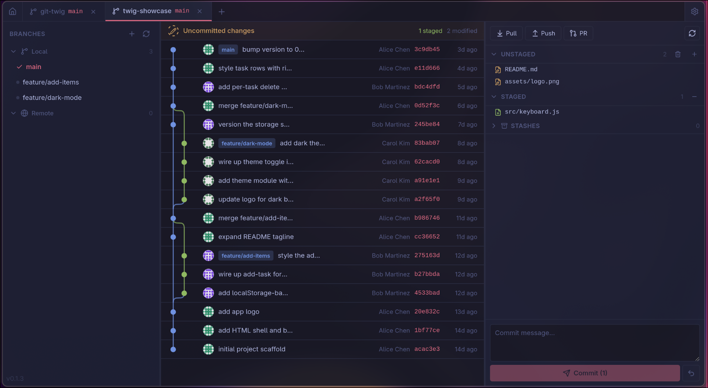

# Twig

**Lighter than the rest.** A lightweight, fast Git GUI desktop application built with Tauri v2.




## Overview

Twig is a GitKraken-inspired Git GUI that prioritizes speed and native Linux Wayland support. It uses a hybrid git backend: **git2** (Rust) for all read operations and the **system git CLI** for all write operations and LFS, giving you both performance and full compatibility.

### Features

- **Multi-repo tabs** -- open multiple repositories in tabs with independent state
- **Visual commit graph** -- branching graph with colored lanes, Gravatar avatars, virtualized scrolling (handles 10k+ commits)
- **Branch management** -- local/remote branch listing, checkout, create, rename, delete, push, fetch
- **Diff viewer** -- unified and split views, syntax-colored additions/deletions, LFS pointer detection, binary file handling
- **Staging area** -- unstaged/staged file lists, per-file or bulk stage/unstage, inline diff preview
- **Commit & sync** -- commit message editor (Ctrl+Enter), push, pull

### Tech Stack

| Layer | Technology |
|-------|-----------|
| Framework | Tauri v2 (Rust + WebView) |
| Frontend | Svelte 5, TypeScript, Vite |
| Styling | TailwindCSS v4 (dark theme) |
| Git reads | `git2` Rust crate |
| Git writes | System `git` CLI via `tokio::process` |
| Icons | Lucide Svelte |

### Target Platforms

Primary: **Linux (Wayland via WebKitGTK)**. Also works on X11, macOS, and Windows.

NVIDIA + Wayland is handled automatically at runtime (GPU detection in `main.rs`).

## Getting Started

### Prerequisites

- **Rust** >= 1.77 (with `cargo`)
- **Node.js** >= 20 (with `npm`)
- **System dependencies** (Linux): `libwebkit2gtk-4.1-dev`, `libgtk-3-dev`, `libappindicator3-dev`, `librsvg2-dev`, `libssl-dev`

On Arch/CachyOS:

```sh
sudo pacman -S webkit2gtk-4.1 gtk3 libappindicator-gtk3
```

On Ubuntu/Debian:

```sh
sudo apt install libwebkit2gtk-4.1-dev libgtk-3-dev libappindicator3-dev librsvg2-dev libssl-dev
```

### Development

```sh
npm install
npm run tauri dev
```

This starts the Vite dev server with HMR and launches the Tauri app. Rust recompiles on changes to `src-tauri/`.

### Production Build

```sh
npm run tauri build
```

Outputs a release binary and platform packages (.deb, .rpm, .AppImage) in `src-tauri/target/release/bundle/`.

## Project Structure

```
twig/
├── src-tauri/                  # Rust backend (Tauri)
│   ├── src/
│   │   ├── main.rs             # Entry point, Wayland GPU setup
│   │   ├── lib.rs              # Tauri builder, command registration
│   │   ├── state.rs            # AppState: thread-safe open repo map
│   │   ├── error.rs            # TwigError enum (thiserror)
│   │   ├── commands/           # Tauri command handlers
│   │   │   ├── repo.rs         # Open, close, list repos
│   │   │   ├── graph.rs        # Commit graph data
│   │   │   ├── branches.rs     # Branch CRUD + push/fetch
│   │   │   ├── diff.rs         # Commit and working diffs
│   │   │   └── staging.rs      # Stage/unstage, commit, pull
│   │   └── git/                # Git operations layer
│   │       ├── reader.rs       # git2-based reads (graph, branches, diffs)
│   │       └── writer.rs       # CLI-based writes (checkout, push, commit)
│   ├── Cargo.toml
│   └── tauri.conf.json
├── src/                        # Svelte frontend
│   ├── main.ts                 # App mount
│   ├── App.svelte              # Root component
│   ├── app.css                 # TailwindCSS v4 + design system tokens
│   ├── lib/
│   │   ├── tauri.ts            # Typed invoke() wrappers
│   │   ├── types/git.ts        # TypeScript interfaces
│   │   └── stores/             # Svelte stores (repos, graph, ui)
│   └── components/
│       ├── layout/             # AppShell, TabBar, Sidebar
│       ├── graph/              # CommitGraph, GraphCanvas, CommitRow
│       ├── branches/           # BranchList
│       ├── diff/               # DiffViewer, DiffHunk
│       └── staging/            # StagingArea
├── index.html
├── package.json
├── vite.config.ts
└── tsconfig.json
```

## Architecture

### Separation of Concerns

All git operations happen in Rust. The frontend only calls Tauri commands and renders state.

```
Frontend (Svelte)  ──invoke()──>  Commands (Tauri)  ──>  Git Layer (git2 / CLI)
    │                                                         │
    └── Stores ◄── State updates ◄── Results ◄───────────────┘
```

### Git Backend (Hybrid)

| Operation | Backend | Rationale |
|-----------|---------|-----------|
| Commit graph, branches, diffs, status | `git2` | Fast, in-process, no subprocess overhead |
| Checkout, commit, push, pull, fetch, stage | System `git` CLI | Full compatibility, hooks, LFS, credential helpers |

### Commit Graph Rendering

The graph uses a lane assignment algorithm that:
1. Walks commits in topological order
2. Assigns each commit to a lane (column), reusing free lanes
3. First parent inherits the lane (straight continuation), merge parents branch off
4. Outputs per-row data: commit lane, pass-through rails, parent lane targets

The frontend renders each row as an SVG with vertical rails, bezier curves for merges, and colored commit nodes. Rows are virtualized (only ~50 visible at a time) for performance with large repos.

### Design System

Dark theme only. Key tokens defined in `app.css` via `@theme`:

| Token | Value | Usage |
|-------|-------|-------|
| `--color-bg` | `#1a1b26` | Main background |
| `--color-surface` | `#1f2335` | Panels, sidebar |
| `--color-surface-elevated` | `#24283b` | Hover states, active items |
| `--color-accent` | `#7aa2f7` | Primary accent (blue) |
| `--color-accent-secondary` | `#bb9af7` | Tags, special branches (purple) |
| `--color-lane-0..5` | Various | Git graph lane colors |

## Contributing

See [CONTRIBUTING.md](CONTRIBUTING.md) for guidelines.

## License

[AGPL-3.0](LICENSE) - Copyright 2026 Igor Kalicinski
