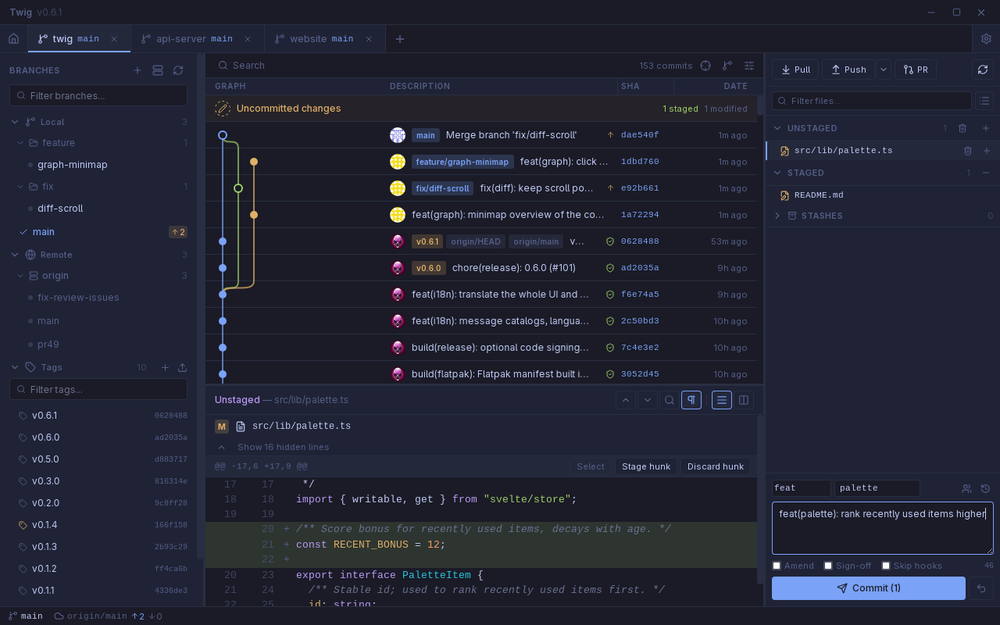
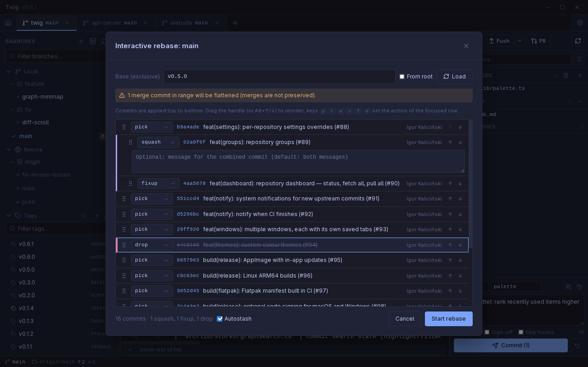
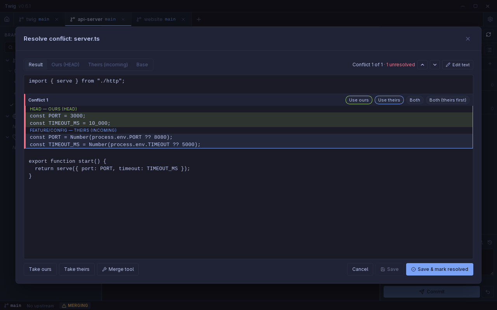
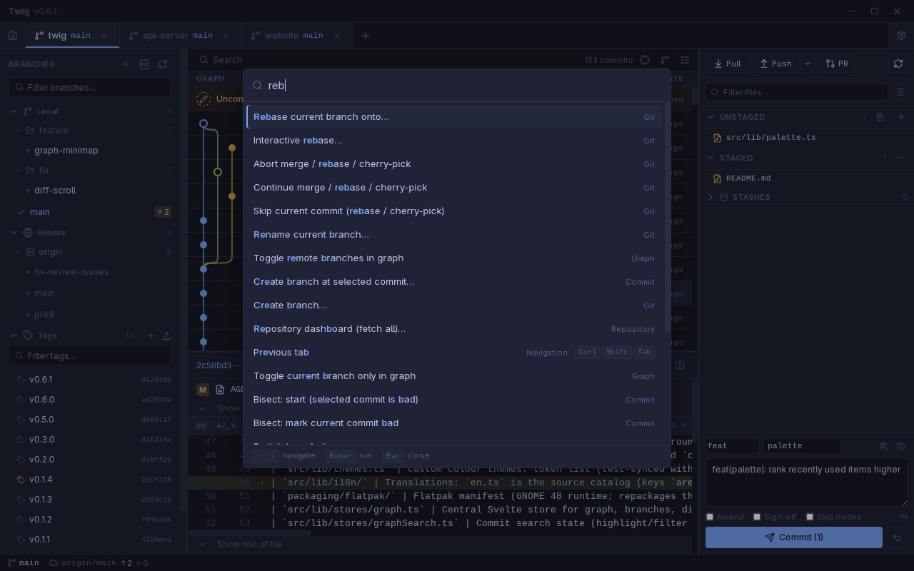
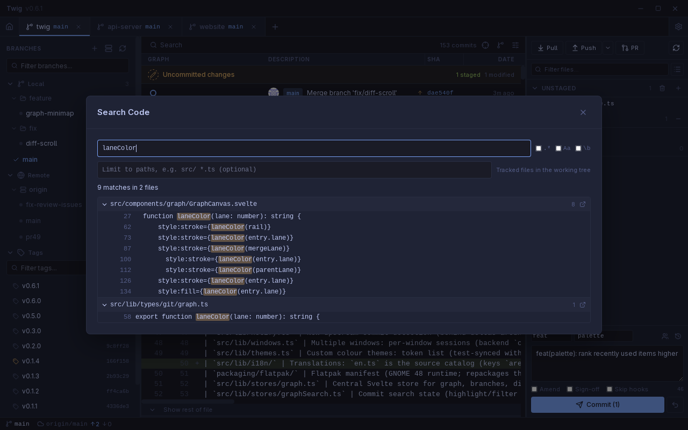
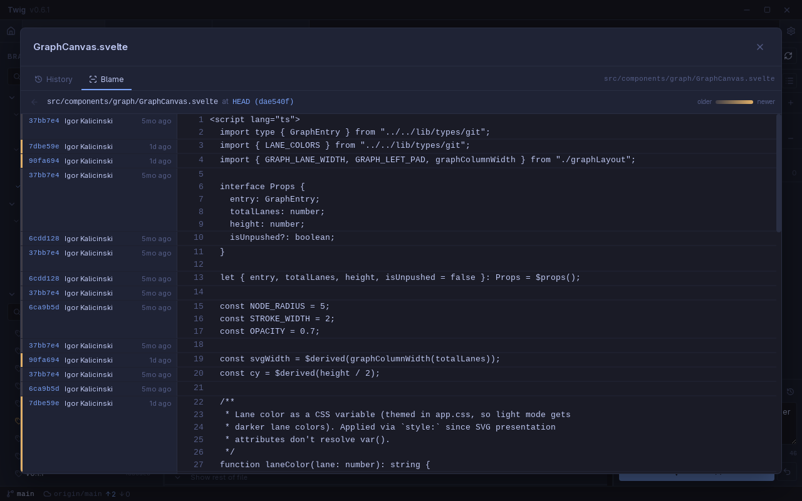
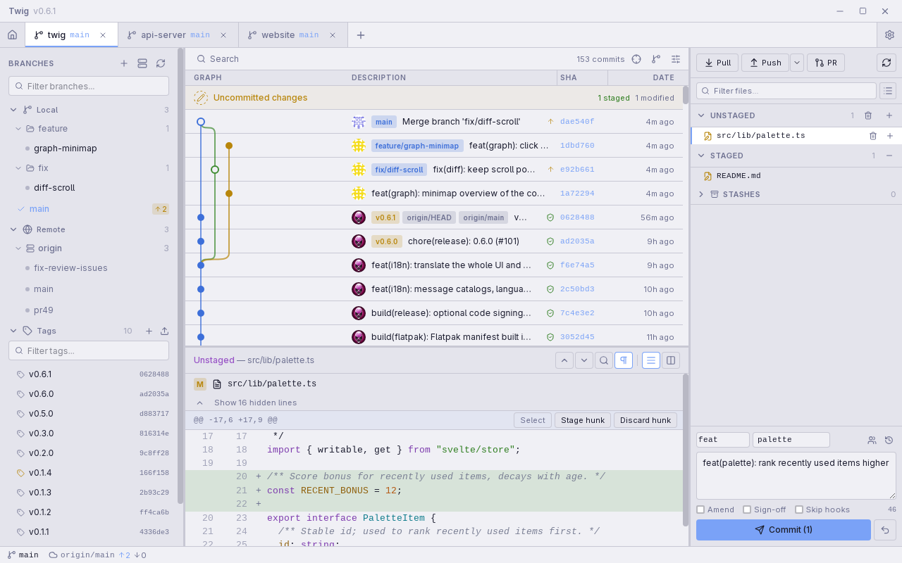

<p align="center">
  
</p>

<h1 align="center">Twig</h1>

<p align="center">
  <b>Lighter than the rest.</b><br>
  A fast, keyboard-friendly Git GUI for Linux, macOS and Windows, built with Rust and Tauri.
</p>

<p align="center">
  <a href="https://github.com/hoxton314/git-twig/releases/latest"></a>
  <a href="https://aur.archlinux.org/packages/twig-bin"></a>
  <a href="https://github.com/hoxton314/git-twig/actions/workflows/ci.yml"></a>
  <a href="LICENSE"></a>
</p>

<p align="center">
  
</p>

## Why Twig

- **Small and fast.** A native Rust backend with a web UI: the Linux `.deb` is about 13 MB and the
  Windows installer about 6 MB. The graph pages through history, so repositories with hundreds of
  thousands of commits stay responsive.
- **Native on Linux.** Built for Wayland first (NVIDIA included), and works on X11, macOS and Windows.
- **Keyboard-first.** Every action is in the command palette (<kbd>Ctrl</kbd>+<kbd>K</kbd>) and can be
  bound to a shortcut.
- **Real Git underneath.** Reads go through `libgit2`; every write goes through your system `git`, so
  hooks, LFS, signing and credential helpers behave exactly like on the command line.

## Install

| Platform | Package |
| --- | --- |
| **Arch Linux** | `yay -S twig-bin` ([AUR](https://aur.archlinux.org/packages/twig-bin)) |
| **Debian / Ubuntu** | `.deb` from the [latest release](https://github.com/hoxton314/git-twig/releases/latest) (x86_64 and ARM64) |
| **Fedora / openSUSE** | `.rpm` from the latest release (x86_64 and ARM64) |
| **Any Linux** | `.AppImage` from the latest release |
| **macOS** | Universal `.dmg` (Intel and Apple Silicon) |
| **Windows** | `-setup.exe` installer |

`.deb`, `.rpm`, AppImage, macOS and Windows installs update themselves from inside the app; the AUR
package updates through pacman. macOS and Windows builds are not code-signed yet, so the first
launch shows a security prompt.

Open a repository from the terminal with `twig .` (or `twig path/to/repo …`); a running Twig picks
it up as a new tab.

## Features

### Everyday Git, without the friction

- **Commit graph** with coloured lanes, branch and tag pills, signature badges and unpushed markers.
  Search by message, author or SHA, filter the graph, or find the commits that added a string.
- **Staging down to the line:** stage, unstage or discard whole files, single hunks or selected lines.
  Tree or flat file list with a filter.
- **Commit box** with amend, sign-off, co-authors, conventional-commit type/scope, templates,
  message history and a "skip hooks" toggle. GPG and SSH commit signing, set up from Settings.
- **Diffs** with syntax highlighting, word-level changes, unified or split view, search, hidden-line
  expansion and image/audio previews. Huge diffs render only what is on screen.
- **Branches, tags and remotes** with right-click menus: checkout, merge, rebase, set upstream,
  compare, push and delete. Drag a branch onto another to merge or rebase.
- **Stashes** you can inspect, rename or turn into a branch, and stash only the files you pick.
  Submodules, worktrees and Git LFS (tracking, locks, prune) each have their own panel.

### Rewrite history with confidence



- **Interactive rebase:** reorder by dragging and set pick, reword, edit, squash, fixup or drop per
  commit, or with one key per row.
- **Cherry-pick, revert, squash and reset** straight from the graph, including ranges of selected
  commits. Select two commits to diff them against each other.
- **Bisect** from the graph: mark good/bad/skip and watch the candidates shrink.
- **Undo history:** every HEAD movement from the reflog, restorable in one click.

### Resolve conflicts in the app



A banner shows any merge, rebase or cherry-pick in progress, with Continue, Skip and Abort. For each
conflicted file you can take ours or theirs, open a three-way view to pick or combine every hunk,
edit the text, or launch your external merge tool.

### Find anything

<table>
  <tr>
    <td width="50%"></td>
    <td width="50%"></td>
  </tr>
  <tr>
    <td>Command palette: every action, branch, tab and repository is a few keystrokes away.</td>
    <td>Code search over the working tree or any commit, with regex, case and path filters.</td>
  </tr>
</table>



**Blame and file history** follow renames, colour lines by age and let you re-blame the line's
previous revision.

### GitHub, GitLab and Gitea

- Sign in with GitHub (device flow) or a token, kept in your OS keyring and never in a config file.
- Clone from your account, browse pull/merge requests with their files and checks, check them out,
  open new ones (including from forks on GitHub) and see CI status on branches. Create new GitHub
  repositories from the app. GitHub Enterprise and self-hosted GitLab/Gitea are supported.
- HTTPS fetch and push use your stored GitHub token automatically.

### Your workspace

- **Tabs, windows and groups:** many repositories in tabs, several windows, repository groups and a
  dashboard that fetches or pulls them all at once.
- **Notifications** for new upstream commits and finished CI runs.
- **Per-repository settings,** custom keyboard shortcuts and settings import/export.



**Dark and light themes,** any accent colour, your own fonts and fully custom colour themes.
Available in English and Polish.

## Keyboard shortcuts

| Shortcut | Action |
| --- | --- |
| <kbd>Ctrl</kbd>+<kbd>K</kbd> | Command palette |
| <kbd>Ctrl</kbd>+<kbd>Enter</kbd> | Commit |
| <kbd>Ctrl</kbd>+<kbd>Shift</kbd>+<kbd>P</kbd> / <kbd>L</kbd> / <kbd>F</kbd> | Push / Pull / Fetch |
| <kbd>Ctrl</kbd>+<kbd>Shift</kbd>+<kbd>G</kbd> | Search code |
| <kbd>Ctrl</kbd>+<kbd>Shift</kbd>+<kbd>H</kbd> | Undo history |
| <kbd>Ctrl</kbd>+<kbd>F</kbd> | Search the graph or the diff (whichever has focus) |
| <kbd>Alt</kbd>+<kbd>↑</kbd> / <kbd>↓</kbd> | Previous / next change in a diff |
| <kbd>Shift</kbd>+<kbd>F10</kbd> | Context menu for the selected item |
| <kbd>Ctrl</kbd>+<kbd>O</kbd> / <kbd>Ctrl</kbd>+<kbd>W</kbd> | Open repository / close tab |
| <kbd>Ctrl</kbd>+<kbd>Tab</kbd> | Next tab |
| <kbd>Ctrl</kbd>+<kbd>B</kbd> | Toggle sidebar |

All shortcuts can be changed in **Settings → Keybindings**.

## Build from source

Requirements: Rust 1.77+, Node.js 20+ (CI uses 22) and, on Linux, WebKitGTK 4.1.

```sh
# Arch / CachyOS
sudo pacman -S webkit2gtk-4.1 gtk3 libappindicator-gtk3
# Debian / Ubuntu
sudo apt install libwebkit2gtk-4.1-dev libgtk-3-dev libappindicator3-dev librsvg2-dev libssl-dev

npm install
npm run tauri dev     # development, with hot reload
npm run tauri build   # release build and packages in src-tauri/target/release/bundle/
```

Checks run in CI on every push: `npm run check`, `npm test`, `cargo clippy --all-targets -- -D warnings`,
`cargo test` and an end-to-end smoke test that drives the real app.

## How it works

| Layer | Technology |
| --- | --- |
| App shell | Tauri v2 (Rust + system WebView) |
| Frontend | Svelte 5, TypeScript, Vite, Tailwind CSS v4 |
| Git reads | `git2` (libgit2), in-process |
| Git writes | System `git` CLI (hooks, LFS, signing and credential helpers just work) |
| Secrets | OS keyring (Secret Service, Keychain, Credential Manager) |

The frontend never touches Git directly: it calls typed Tauri commands, and Rust does the work.
[AGENTS.md](AGENTS.md) describes the architecture, conventions and key files in detail, and
[ROADMAP.md](ROADMAP.md) lists what's next.

## Contributing

Issues and pull requests are welcome. See [CONTRIBUTING.md](CONTRIBUTING.md).

## License

[AGPL-3.0](LICENSE). Copyright 2026 Igor Kalicinski.
